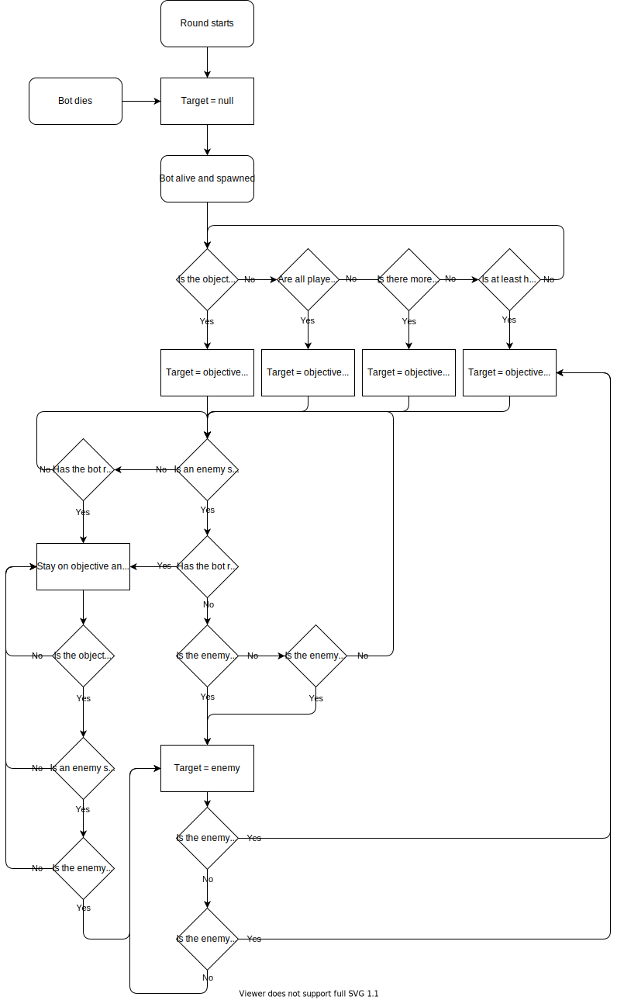

# overwatch-bots-ai

Generic gamemode to fight against workshop bots.

First version should include:
- 6 heroes
  - Tank 1: Winston
  - Tank 2: Dva
  - DPS 1: Tracer
  - DPS 2: Genji
  - Healer 1: Ana
  - Healer 2: Zenyatta
- 1 map (chosen to be Nepal)
- AI good enough to beat a bronze team

This gamemode has the goal to be generic, so:
- Do not assume that the enemy team is entirely made of humans or bots
- Same for the bot's own team, it can contain humans
- Do not assume that the bot team is team 2

For now, we make the bots the best they can be, meaning they have wallhacks, aimbot, and know everything about enemies (such as their hp or ult charge).

The algorithms we should implement are as follow (still WIP):

- Target of bot

